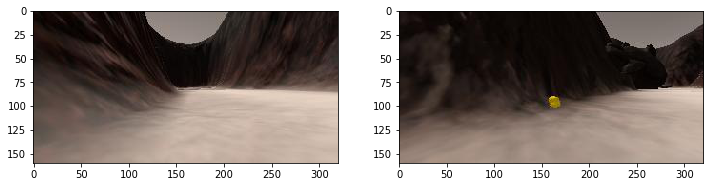
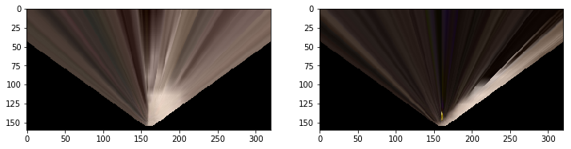
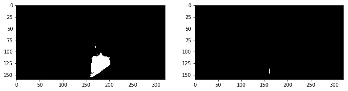
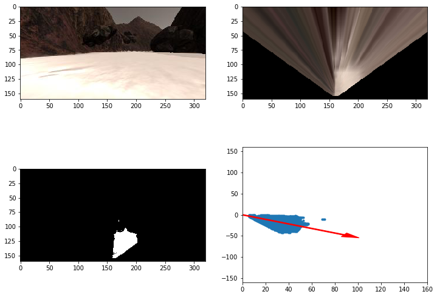
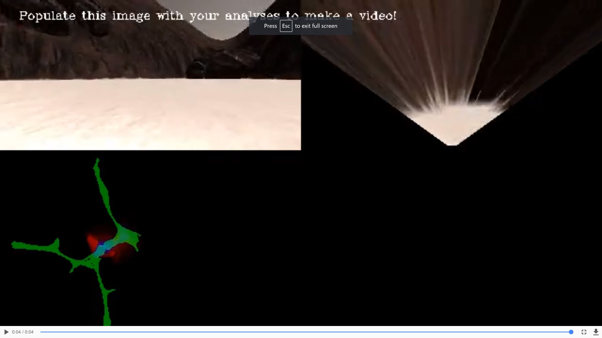

## Project: Search and Sample Return

**Objective**  
To achieve a minimum of 60 % fidelity to the ground truth while mapping at least 40% of the environment. Identify at least 1 rock samples from the envoironement.

**Environemnt /Setup**
* Udacity Rover Simulation Roversim
* Udacity RoboND-Python-Starterkit

**Notebook Analysis**
The purpose of this project is to map a environment using a rover and ensure at least 60% fidelity to the ground truth while mapping aat least 40% of the environment. The evnvironemnt and rover is simulated in the "Udacity Rover Simulation Roversim". There are two mode in the simulation software: Training mode and Autonomous Mode. A perception pipeline has been created to analyze the picture capture from the camera on the rover and provide guide for the rover to be able to move autonomously.

"Training mode" has been used to record some data to test out the perception pipeline.

The perception pipeline steps are as below.
1. Read in image samples. Two images are selected here to represent navigable route, obstacle, and rock.

2. Use perspective transform and warp perspective function from OpenCV to transform the image from first person view to a top down map view. (perspect_transform(img, src, dst))

3. Use color threshold function to differentiate navigable route (light brown), obstacle (dark brown), and rock(yellow). RGB has been selected to filter out the objects by using lower limit and upper limit. (color_thresh(img, rgb_thresh=(160, 160, 160), rgb_thresh_max=(255,255,255)))

4. Convert the pixel to pixel location on world map to map the data onto the map coordinates. Mean angle is calculated for the navigable route and is plot out as an arrow.

The perception pipeline is populated in the `process_image()` function and the function is then used to process each frame of image to produce a video of mapping navigable route, obstacle, and rock on the ground truth map data.

---

### Autonomous Navigation and Mapping

##### Perception
The perception pipeline is added into perception.py under the `perception_step(Rover)`. The main difference from the noteboook analysis is by taking Rover as a input object and use the Rover object information to perform the perception steps. 

RGB threshold are as below to provide a higher fidelity.
Navigable route: 
* lower limit = (160,160,160)
* higher limit = (255,255,255)
* channel = blue
Obstacle: 
* lower limit = (0,0,0)
* higher limit = (80,80,80)
* channel = red
Rock:
* lower limit = (30,90,0)
* higher limit = (230,230,75)
* channel = green
 
##### Decision
In the decision_step function, I added a conditional to check if the rover is currently picking up a sample, and if so, to stop any movement and set the mode to 'stop'.  Next I added the check if a sample is near the rover.  If there is, then send the pickup sample signal to the rover, increment the samples_found count, stop moving, and set the mode to 'stop'.  
The last conditional I added was a check if the rover mode was 'rock_visible'.  If it was, then max out the throttle and steer toward the rock, regardless if there is not enough navigable terrain to continue much farther.  This was done because the rock samples are close to the walls, and the normal 'forward' mode tells the robot to stop and turn away from walls.

#### Autonomous mode

My simulator was running at ~30 FPS with 1600x1200 resolution and 'Fantastic' graphics quality.

My approach is working for the most part, and is able to map at a fidelity of 68.9% when mapping 41.7% of the map. Mt rover can also sucessfully identify and locate all the rocks that it passes by. 

However, there is a few drawback on my approach that include no intelligent algorithm for exploration of the map, it will repeat the mapping at the same spots several time based on the direction that is calculated from the perception pipeline. Besides, it will get stuck when it has crashed with a rock without turning the rover mode into stop mode. It will take a couple minutes for the rover to be able to escape from that condition.

I would like to add a stuck mode for the rover mode and allow it to get out from 'stuck' condition easier. I woild also like to add pick rock function in future.
